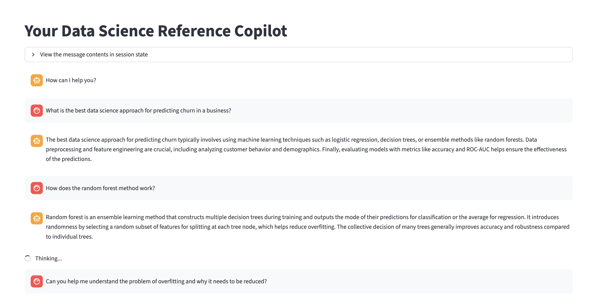
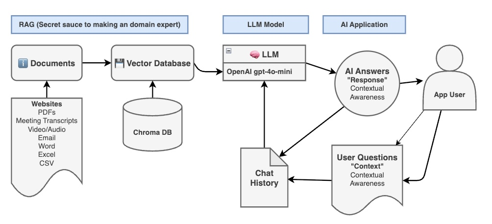

# RAG Copilot App for Data Science Textbook

A two-part LLM-enabled program that creates 
1. A vector database out of a long PDF such as a textbook
2. An interactive RAG-powered chat with session memory, via Streamlit

**[Watch the demo](your-loom-link-here)**

Screenshot preview of app in browser:



**Tech stack:** Streamlit · LangChain · Chroma · OpenAI API

## Project Files

* `01_vector_db_statistical_learning.py` — script to create the vector database from the PDF contents. Uses chunking to perform at scale.
* `02_app_statistical_learning.py` — the Streamlit app. Ask data science questions and get relevant answers based on the source material and conversational context.
* `environment.yml` — conda environment spec (`env_ds_rag_0904`) with all required packages.
* `credentials.yml` — API key used by the app (`openai`). Real file not committed - create and fill in your own based on the `credentials.yml.example` template
* `pdf/ISLP_website.pdf` — the source textbook the vector database is built from. Swap this out to run the app on a different document (see below).
* `data/chroma_statistical_learning.db/` — the persisted Chroma vector store, generated by `01_vector_db_statistical_learning.py` and read by `02_app_statistical_learning.py`. Generated output, not meant to be hand-edited.
* `img/rag_model.jpg` — diagram of the RAG pipeline used in this app.

## Prerequisites

* Python (via conda, see below)
* An OpenAI API key

## Setup

1. Create and activate the conda environment:

    ```
    conda env create -f environment.yml
    conda activate env_ds_rag_0904
    ```

2. Create `credentials.yml` and add your OpenAI API key:

    ```yaml
    openai: sk-...
    ```

## Running the App

Run the two scripts in order — the vector database must exist before the app can query it:

1. Build the vector database (only needed once, or whenever the source PDF changes):

    ```
    python 01_vector_db_statistical_learning.py
    ```

2. Launch the chat app:

    ```
    streamlit run 02_app_statistical_learning.py
    ```

## How It Works

The app uses a `qa_system_prompt` to guide the connected LLM's answers: it instructs the LLM to answer only from the retrieved context, admit when it doesn't know, and keep responses to three sentences or fewer. This prompt is domain-agnostic — it isn't hardcoded to the statistical learning textbook, so it works as-is for any source PDF. A second prompt (`contextualize_q_system_prompt`) rewrites follow-up questions into standalone queries using the chat history, so retrieval stays accurate across a multi-turn conversation. What *is* specific to this iteration is the Streamlit UI copy (page title and chat input placeholder), which references "Data Science" — see below for pointing the app at a different document.

Basic mapping of the model:


## Using a Different Document

The vector database and the chat app are decoupled, so swapping in a new PDF means rebuilding the database before the app can use it:

1. Add your PDF to `/pdf` and update the `PyPDFLoader(...)` path in `01_vector_db_statistical_learning.py`.
2. Delete the existing vector store at `data/chroma_statistical_learning.db` (or point both scripts at a new `persist_directory` — see note below).
3. Re-run `01_vector_db_statistical_learning.py` to embed the new PDF and build a fresh vector store.
4. Update the "Data Science"-specific UI copy in `02_app_statistical_learning.py` (the `st.set_page_config` page title, `st.title`, and the `st.chat_input` placeholder) to match the new subject matter. The `qa_system_prompt` and `contextualize_q_system_prompt` are generic and don't need to change unless you want to tune tone or behavior.
5. Optional: adjust `CHUNK_SIZE` in the `CharacterTextSplitter` — larger documents or denser material may need different chunking for retrieval quality and cost.

**Note:** the Chroma `persist_directory` path (`data/chroma_statistical_learning.db`) is hardcoded separately in both scripts. If you rename it, update it in both places.

## Limitations

* Tested primarily on the statistical learning textbook; other source PDFs will work with the existing prompts but may need UI copy adjustments (see above).
* `PyPDFLoader` extracts text only — figures, equations, and tables in the source PDF may not be captured well, which matters for a math-heavy textbook.
* No chunk overlap is configured as-is (`chunk_overlap` is commented out in `01_vector_db_statistical_learning.py`), so relevant context could be split across chunk boundaries and missed by retrieval.
* Rebuilding the vector database re-embeds the entire document, which costs OpenAI API calls proportional to document length.
* Chat history is held in Streamlit session state only — it resets on page refresh or app restart, and isn't saved anywhere durable.
* The app uses a single hardcoded `session_id` ("any"), so if deployed for multiple simultaneous users, they would share one chat history rather than getting their own.
* Answers aren't tied back to source page numbers, so verifying a claim against the original textbook takes manual lookup.
* Uses OpenAI's `text-embedding-ada-002`, an older embedding model; a newer embedding model may improve retrieval quality.